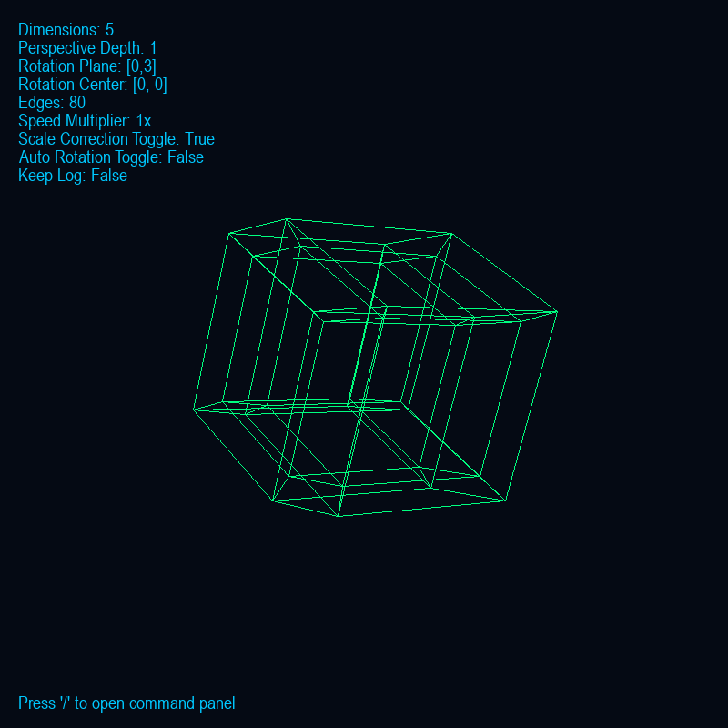

# N-D Wireframe Renderer

Author: Jerry Yang  
Language: Python  
Dependency: pygame

---

## Overview

**N-D Wireframe Renderer** is an interactive visualization tool for exploring **geometric structures in higher dimensions**. It projects N-dimensional shapes into 2D space, allowing you to visualize complex geometries from any angle. Users can rotate shapes manually or automatically, apply different color palettes, and capture screenshots. You can load preset shapes (like hypercubes and hyperpyramids), or design your own wireframes through commands. It’s designed for both educational purposes and casual experimentation with higher-dimensional geometry.

---

## Screenshots

Example: 5D Hypercube Projection

Additional examples are available in the /screenshots/ folder.

---

## Features

- Render and rotate 2D → N-dimensional wireframes  
- Interactive command-based interface  
- Perspective & orthographic projection modes  
- Auto-rotation and manual rotation controls  
- Multiple color palettes  
- Save / Load custom structures  
- Screenshot capture (Ctrl+S)  
- Built-in presets: hypercube, hyperpyramid

---

##  Controls

| Key / Combo | Action |
|--------------|--------|
| → / ← | Rotate object in the current plane |
| ↑ / ↓ | Cycle through rotation planes |
| R | Toggle auto-rotation |
| Q | Toggle scale correction |
| + / - | Adjust perspective depth |
| [ / ] | Adjust rotation speed |
| TAB | Toggle info overlay |
| P | Cycle color palettes |
| CTRL+S | Save screenshot |
| / | Open command panel |
| ESC | Quit the program |

---

## Command Panel

Press "/" while running to open the command console.  
Commands are text-based and allow dynamic editing of the active wireframe:

| Command | Description |
|----------|-------------|
| add | Add a new line between two N-D points |
| remove | Remove a specific line |
| view lines | List all lines currently drawn |
| clear | Clear all lines |
| center | Set the rotation center |
| plane | Change the active rotation plane |
| preset | Load preset objects (hypercube, hyperpyramid) |
| dimensions | Set the number of dimensions |
| save | Save current wireframe to a file |
| load | Load a wireframe from a saved file |
| log | Toggle console logging |
| keys | Display keyboard controls |
| help | Show all available commands |
| quit | Exit the program |

---

## Project Structure

nd-wireframe-renderer/  
├── wireframe_renderer/  
│   ├── main.py  
│   ├── data.py  
│   ├── events.py  
│   ├── panel.py  
│   ├── presets.py  
│   ├── render.py  
│   └── utils.py  
├── file_shapes/  
│   ├── horse.txt  
│   └── ...  
├── screenshots/  
│   ├── Screenshot.png  
│   └── ...  
├── README.md  
├── LICENSE  
├── .gitignore  
└── requirements.txt

- file_shapes/ — saved or custom wireframe definitions  
- screenshots/ — captured images (use Ctrl+S to save)

---

## Demo

A demo file horse.txt is included in /file_shapes/ — load it to see the renderer in action.

---

## Installation

1. Clone the repository:
   git clone https://github.com/jerryyang2025-design/N_Dimensional_Wireframe-Renderer
   cd N_Dimensional-Wireframe-Renderer

2. Install dependencies:
   pip install pygame

3. Run the program:
   python main.py

---

## How It Works

The renderer projects points from N-dimensional space to a 2D plane using a perspective projection algorithm.  
Each frame, it rotates the active wireframe within a user-selected rotation plane and draws the connecting edges with pygame.

You can:
- Build shapes manually in the command panel  
- Load saved shapes from /file_shapes  
- Experiment interactively with higher-dimensional geometry

---

## License

This project is licensed under the MIT License.  
See the LICENSE file for full details.